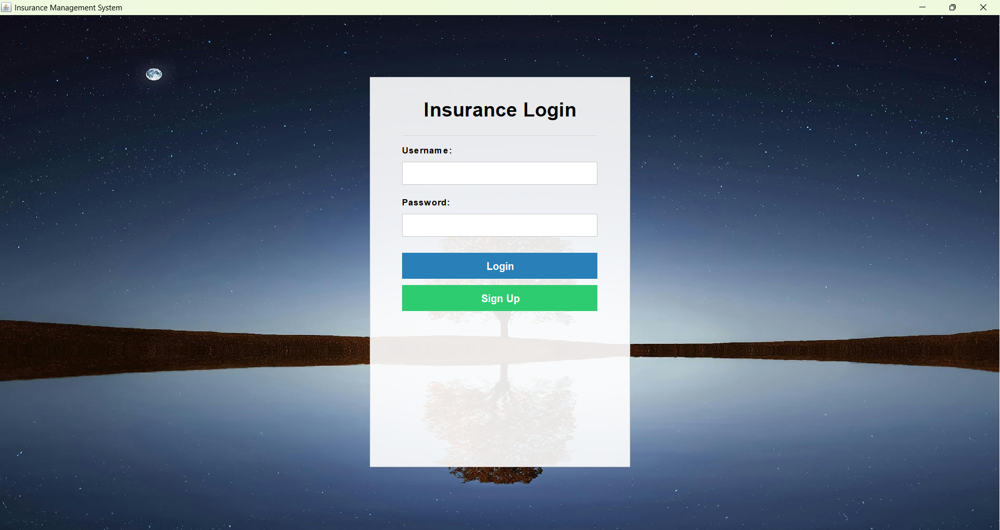
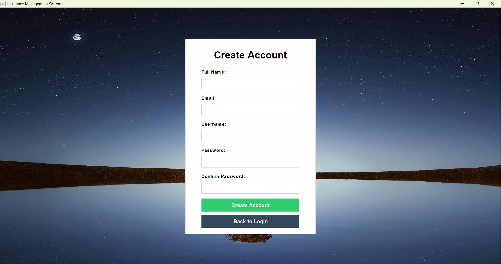
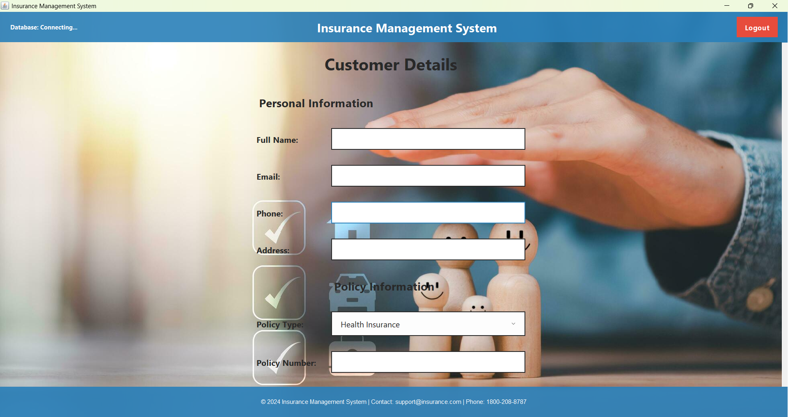
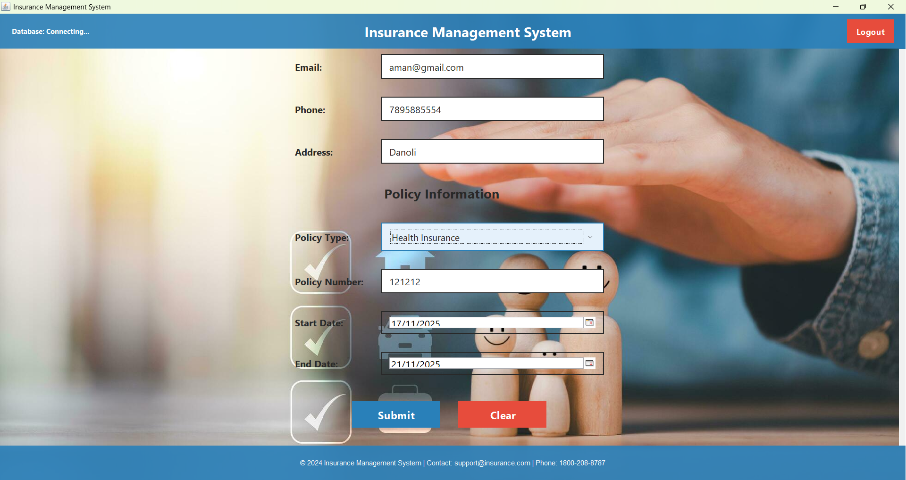
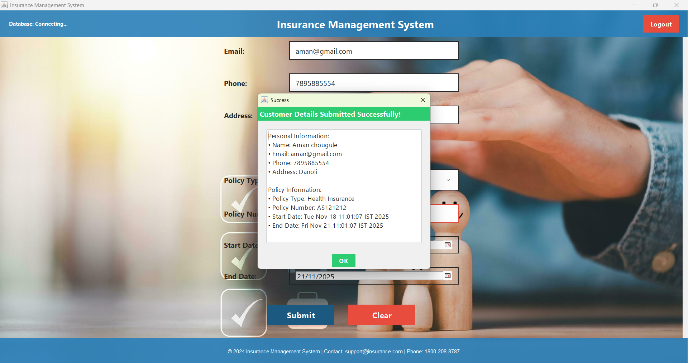

### 📘 Insurance Management System (Java Swing)

A simple and modern Insurance Management System built using Java Swing, with Oracle database connectivity. The system allows users to log in and manage customer details, policies, and related information.

## Screenshots

---

## Login

---
## Sign In

---
## Home Page

---

---

## Registration Successful Message

---

### 🚀 Features

User Login System

Add Customer Details

Policy Information Form

Form Validation

Oracle Database Connectivity

Clean & Modern UI (Swing)

Scrollable UI + Hover Effects

Auto-generated Customer ID

## 🛠️ Tech Stack

Java Swing

Oracle Database (ojdbc8 driver required)

JDBC

JDateChooser (Toedter Calendar)

### 🔧 How to Run

Install JDK 8 or above

Download ojdbc8.jar and place in /lib

Create the database tables using /sql/create_tables.sql

## Run the project:

javac InsuranceSystem.java
java InsuranceSystem

## 🎯 Database Configuration

Update your Oracle DB details in InsuranceSystem.java:

String url = "jdbc:oracle:thin:@localhost:1521:XE";
String username = "YOUR_USERNAME";
String password = "YOUR_PASSWORD";

📸 Screenshots

(Add your UI screenshots here)
